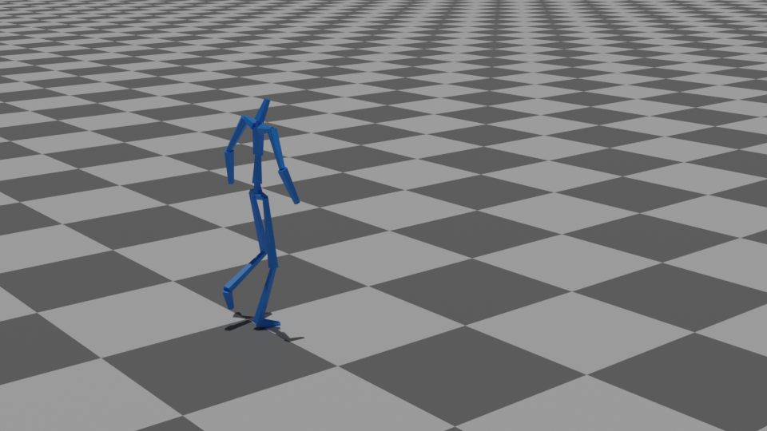

# CV-project

## Introduction

```
git clone https://github.com/lorenzialessandro/CV-project.git
cd CV-project
```

## Task 1

## Task 2

## Task 3


## Task optional
Instead of evaluating results on Matplotlib or open3d it would be much better to forward data to a more suitable environment such as Blender.
We adapted [**deep-motion-editing**](https://github.com/DeepMotionEditing/deep-motion-editing) framework to our data.
Please use as reference requirements specified in the deep-motion-editing repository.
<br><br>

before testing, set an alias to the blender executable as :
(For Linux users)
```
gedit ~/.bashrc
```
and write as last line of file
```
export PATH=/path/to/blender/folder/:$PATH
```
Then save and close. From now on running "blender" on the terminal directly launch the blender environment


<br>

\<OPT\> : mandatory parameter, chose among : { RENDER | SKINNING }
```
python3 main_extra.py <OPT>
```

