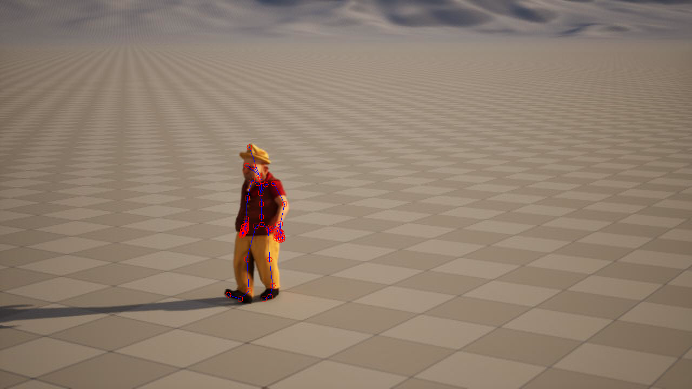

# CV-project

## Introduction

```
git clone https://github.com/lorenzialessandro/CV-project.git
cd CV-project
```

## Task 1

## Task 2

## Task 3

Inside an <b>Unreal Engine 5 (UE5)</b> virtual environment we want to achieve 3D to 2D projection of joint positions onto the camera plane.
We properly modelled the scene inserting 2 core blueprints, one containing our main actor and the other containing the camera
<br>
<p align="center">
  
</p>

Using the blueprint engine together with [json Blueprint Utilities](https://www.unrealdirective.com/tips/json-blueprint-utilities-plugin) plugin we implemented a script to extract data in <b>Json</b> format (available for visualization [**Here**](https://blueprintue.com/blueprint/_qn_vgvc/)). Using openCV and the extracted data we're able to project skeleton joints on the camera frame:
<br>
```
python3 main_3.py
```
<br>
<p align="center">
  
</p>
<br>

## Extra Task
Instead of evaluating results on Matplotlib or open3d it would be much better to forward data to a more suitable environment such as Blender.
We adapted [**deep-motion-editing**](https://github.com/DeepMotionEditing/deep-motion-editing) framework to our data.
Please use as reference requirements specified in the deep-motion-editing repository.
<br><br>

before testing, set an alias to the blender executable as :
(For Linux users)
```
gedit ~/.bashrc
```
and write as last line of file
```
export PATH=/path/to/blender/folder/:$PATH
```
Then save and close. From now on running "blender" on the terminal directly launch the blender environment

<br><hr><br>

```
python3 main_extra.py <OPT>
```
\<OPT\> : mandatory parameter, chose among : { RENDER | SKINNING }
* RENDER : imports the [animation_small.bhv](resources/360fps/animation_small.bvh) into a Blender scene, adding : checkerboard floor, sun, meshes linked to bones and assigned to a default materials + a camera ready to render the scene
* SKINNING : imports the [animation.bhv](resources/360fps/animation.bvh) as animation and retargets it to a [mesh](resources/ue5/TheBoss.fbx)
<br>
<p align="center">
  
</p>
